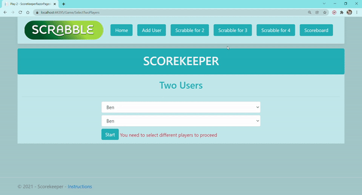

# SCRABBLE SCOREKEEPER WEB APPLICATION

<!-- ABOUT THE PROJECT -->
## About The Project

* Scrabble Scorekeeper is a family app that uses a database to keep track of scores and winners! 
* In more technical terms, it is a CRUD web application developed in ASP.NET Core Razor Pages that targets .NET 5

## Built With
* Visual Studio 2019 and 2022
* C#
* ASP.NET Core
* xUnit for Unit Testing
* Entity Framework Core 
* SQL Server
* Bootstrap 4
* LINQ queries
* CSS
* HTML

## Overview

* ### Add players and their scores during each round. Tally the results and display them in the scoreboard

* ### Edit players' names
##### (Editing scores without playing would be cheating so it is not allowed)

* ### Delete a player from the database

## Data Validation

* ### The app doesn't accept the same name twice

* ### The same user can't be selected twice during the same game

* ### Users can't enter null/empty data to the database

* ### Negative scores are not allowed

